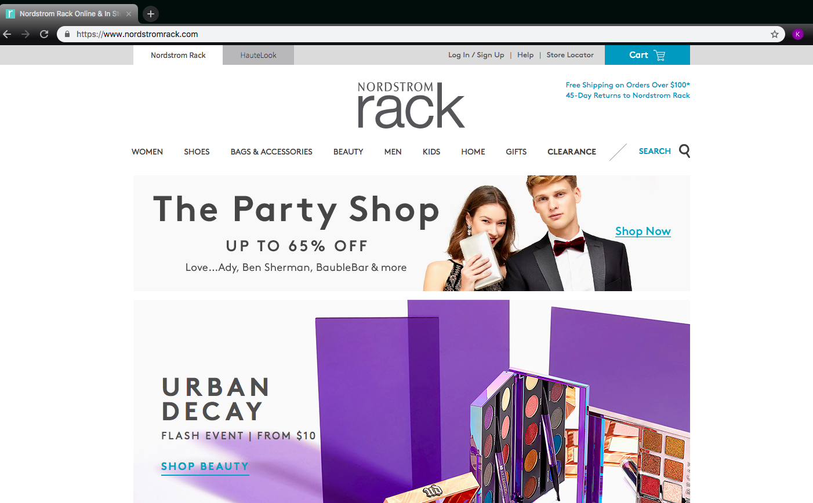
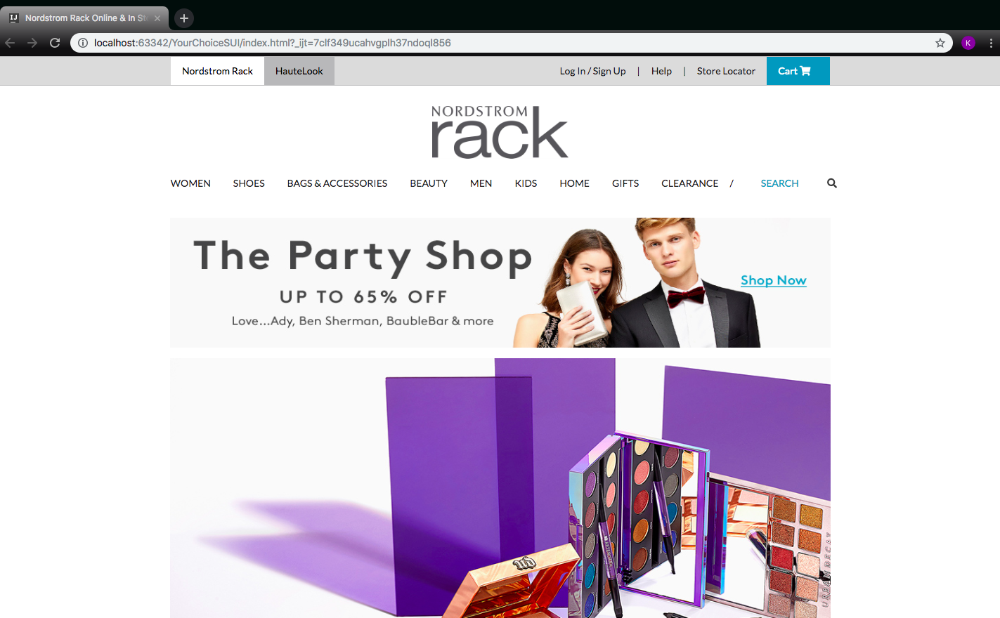

When you first open a webpage, the greatest impression you get is how clear it is to read and look at. But if your thinking it’s just like a google docs sheet filed with writing and pictures, then that’s not exactly right. What your looking at is the result of using a user interface (UI) framework that uses software tools for building software programs to run on the web, some examples include the use of HTML and CSS.

## As For My First

I’ve had the experience of recently being introduced to a framework called Semantic UI. My first practice was by my instructors practice of building a simple version of the clothing website, Island Snow. At first I couldn’t figure out where to start that I even got stumped on what the little bird icon was, I remember now though, it’s twitter. My own attempt at it ended up having a image I referenced in cover the entire page. Then I watched my instructors videos and realized how much easier it is to divide the webpage into parts from top to bottom. Basically the key factor is to remember that when you work on something you should build on to it one at a time.

<a href="https://islandsnow.com/">Island Snow Website</a>

## My Choice

After having the pleasure of trying out my first practice I had the opportunity of choosing to make my own imitation of a webpage. I chose the homepage for Nordstrom Rack because I used to work there. When I built up on my version I ended up with five branches on Github till I pushed my final product to my master, it really kept me organized and easier to work with. Another important thing I figured out is how helpful “containers” are, because it saves you a lot of time on keeping your contents in place and easier to work on making the widths of the whole webpage the same. If you look below I have the real one on the left and my version on the right. Because I used containers for my top menu bar and the categories bar, I could line them up at the center in the same width. 

  

    
    
  

Although some say that Semantic UI is frustrating, I found this experience to be quite fun because I learned how to use HTML and CSS to build a front page and every time I go back to my work I find new ways to improve it.

