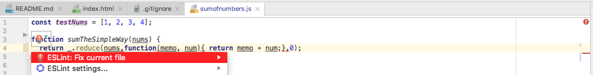

Everyone has their very own coding style. Having a coding style expresses individuality and professionalism. An efficient style greatly helps in finding debug errors and helps one work with comfort with multiple files. Unlike coding languages that are slightly different you can use the same coding style in all of them.

## My Coding Style
My style has been formed from coding in Javascript, C, and C++. As I code I tend to not include as many spaces in my conditions. For instance in my for loops I would type something like ”for(let i=0;i<10;i++)”, on this one line there’s only one space between the “let” and “i”. In addition I also include plenty of comments all over my code files, either on its own line or behind a line with code. If someone else looked at it I bet they would find it very crowded, but it’s the style I find most informative to study my work. Another habit in my style is including numerous newlines. For example in my if/else statements my closing curly bracket would be on a newline on it’s own and then “else” would go on a entirely newline. When I was doing lab assignments for C++, my grader explicitly stated that he wanted no extra empty newlines. He said it was his style of coding and that it was best to have as less lines of code as much as possible. I understand what he was saying and that having less lines of code on one file is best, but I’m fine with taking up more lines of code to be more organized.

## Pro Javascript Tool

