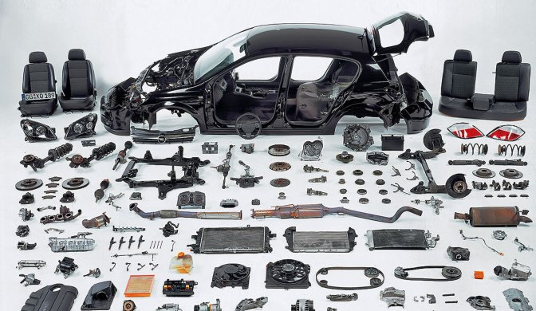

Before starting to learn software in college I thought of it as only continuous long lines of characters with no spaces. So I asked around for a more definitive explanation of what programming uses and how it was done. Then when I spoke to one of my cousins, she said to think of it as more of a car. Specifically, imagine how I would make a car?

## Designing my car

To design a car you need to have a frame to shape the car, you also need the windows, tires, and door, and most importantly you need the engine. Basically they result into three different patterns (structural, creational, and behavioral) that you need to program. The frame, or structural pattern, lays out the functionality or path that objects can follow. While creational patterns, like the windows and tires, may just be different classes but they relate together to become one object. Finally the engine (behavioral pattern) makes the objects all communicate together to function as one. 

Another amazing thing is that the pieces make something strong together, but when seperated they can still serve as reusable second hand parts to fix other cars. For example, functions may do different things, but on the other hand are made using similar structures.

## Driving my car

I have recently 

