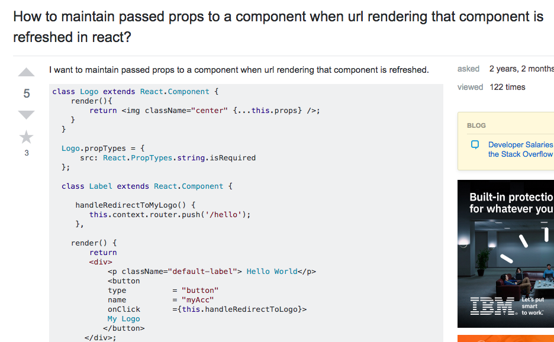

The software engineering community is a very sharing environment. As comrades in profession we will help one another in our software issues because we all know and understand what it is like to get stuck in our problems. Since I started learning software and if I ever came across a difficult standstill when I'm at home I've relied on StackOverflow. Through StackOverflow I have searched for other similar circumstances as I did to reach a possible solution that others have already found a solution to. But because StackOverflow is such a large network I have had to look and read through a vast amount of questions and answers till I found any that was most similar to my problems.

## Compare Good vs. Bad

In the first image I have provided is a case of a good smart way to ask a question that I have found on StackOverflow. The person that posted this question was very specific in their header about their problem and what environment they were in. Although the post they gave was long the overall volume wasn't exactly a lot there is only a short and straightforward description along with big visuals of the issue. To me, this post was simple yet very descriptive to ask others for help because I could very easily see the problem. As a result this post obtained many comments where towards the end it got close to a solution.

On the other hand, there is the bad way to ask a question as shown in the next image. This post also has a precise header including the issue and environment of the problem. However after reading the header again it is actually asking two questions, one on ios safari and the other on ios chrome. The question should be focusing on one environment, not one or the other. As I also read the actual description of the question it's very short and again continues to ask about multiple cases, it asks of the desktop, tablet, and smartphone environment. The provided tags are distinct yet when looking at the question it doesn't relate to the main topic, either it's asking about javascript or ios. If the post had given maybe some visuals or be more specific then there might have been some relation to it but as a result this post has been put up since May 2015 and after three years there is still no comment or answer back.

## Why it's important

Asking software engineers questions for help to me means to be blunt, short, and descriptive. Software engineers spend a lot of time having to read lots of code and don't want to have to read around your words. Therefore if I want to get assisted through my problem I need to use the smart way or else I end up like the bad way example and get ignored.

StackOverflow:
<a href="https://stackoverflow.com/questions/38056800/how-to-maintain-passed-props-to-a-component-when-url-rendering-that-component-is"><i class="large github icon "></i>Good Question</a>,
<a href="https://stackoverflow.com/questions/30251638/how-to-detect-request-desktop-site-mode-of-ios-mobile-safari-and-chrome"><i class="large github icon "></i>Bad Question</a>
