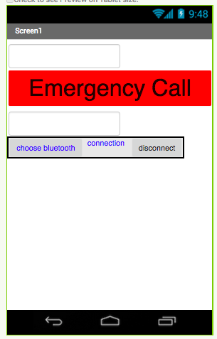
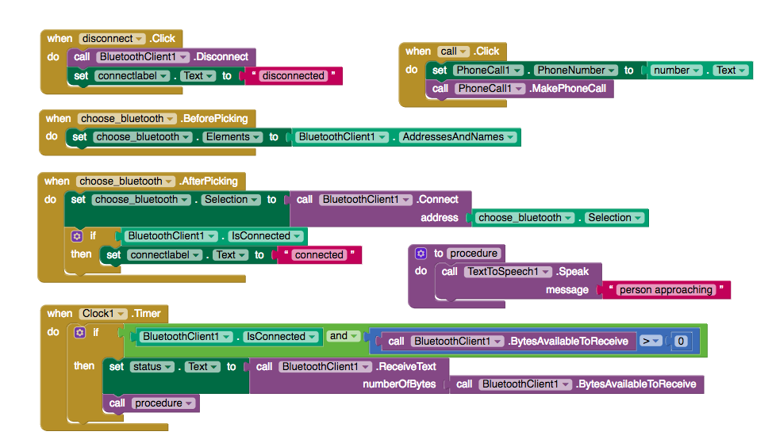

I imagine everyones had the experience of walking in the dark and in places with very little people around. It's always best to have a sense of security on hand, so that is why for my EE296 project me and my partner decided to proposed and developed a personal security system that warns a user and calls an emergency contact if a stranger is approaching from behind them

The project was implemented using Arduino and MIT Appinventor technology, while collecting data from an IR motion sensor. My role was to construct an app on the MIT Appinventor to be able to speak warnings and call an emergency contact after receiving data by bluetooth connection. Me and my partner had to work together on to code first by understanding our distance sensor and implementing it into code to send to the MIT. I had to build the MIT Appinventor to receive the data from the used IR motion sensor to speak message “person approaching” and implement the phone call function to call a emergency contact. So that the data is received by bluetooth from the circuit board and android.

 
  

    
    
  

I enjoyed this small project because I was able to implement software and hardware together, which really helpsto give me more experience as a computer engineer.

GitHub Repository: <a href="https://github.com/klin6/EE296proj/blob/master/finalproj.c"><i class="large github icon "></i>GotYourBack</a>
 
