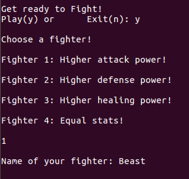
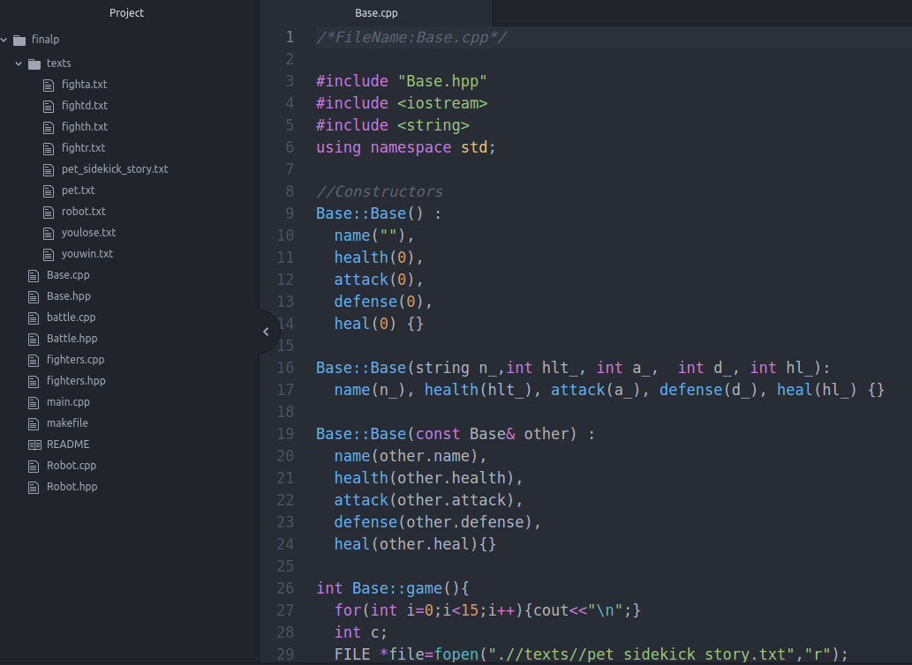

To show how much me and my team learned C++, we decided to program a game where the user may choose between four different types of fighters, each from their own class to fight a robot boss.

After the game starts and the user chooses a fighter they can name the fighter, then the status of both fighter and robot is shown. To fight the battle the user can choose from attack, heal, or lower robot's defenses each action. While the robot is on a randomizer between attacking, healing, or doing nothing at each action. Best way to win the game is to focus on lowering the robots defenses first, then attacking.

    
    

My role throughout the whole project was to work on putting together and organizing all members files. Because everyone worked separately I had to debug files and change formatting. I personally worked on the display functions around the main battle file. I basically used file scanning with fopen and fclose as functions. At the finishing point of the project I realized that the game was a bit lacking so I included a one time only mini guessing game to the battle that would give a pet sidekick special attack.

GitHub Repository: <a href="https://github.com/klin6/EE205proj"><i class="large github icon "></i>Robot Game</a>
 
This game was enjoyable for me and a new experience because I never really played games where complex attack, health, defense, and heal gameplay development was necessary. If I could improve on this game though, I would use implement vectors to display actual movement to the battle.
