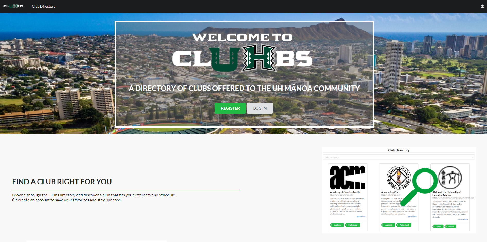
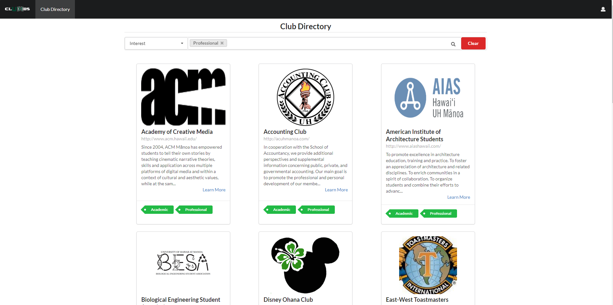

University of Hawaii at Manoa has a student population of around 17,000 people along with a vast amount of clubs that have reached at least 250 kinds. The school provides a spreadsheet list of all the clubs with only their name, type, and contact information. Hence provides the student to have to search for more information on their own. Therefore I worked in a team to create an application, that would let students access a directory listing to view clubs in easier to find detail and direct links to their websites, called clUHbs.

A regular user can register an account then have access to the club directory and favorite any that interest them, create and edit a profile, edit their account settings to specify which types of messages they wish to recieve at their homepage, and be able to select the areas of interest that they would like to focus on. Additionally the user may make a request to the super administrator to become a club admin. Once the user becomes a club admin they can do everything like a regular user but now they can add a new club and edit it anytime they want. Finally there's the super admin who has access to edit all clubs, make any user become a club admin, along with receiving updates on all changes that happen.

My role in this project was mainly leading and staying up to date with all group members progress so that everyone was upto date. During the project I implemented the creation of the club collection. The club collection made the club directory list to display all default and added clubs for the super admin to view. At the same time I then created the add club page, which later got its layout changed by my group member <a href="https://kathleen808.github.io/">Kathleen</a>. Then I created the request collection for the regular user to submit a request that only the super admin would see at their home page. The super admin has the choice to either accept the request which will call on the users ID and set their role to clubAdmin or denying them to just deleting their request and sending a rejection message to the user. Along the way I did multiple merging, conflict resolving, and moving some organization formating. Towards the end I went through the Registered Independant Organization (RIO) list from the school to input more that twenty five default clubs to the club directory in the configuration file, settings.development.json.

From this project I learned much more indepth about meteor and using Javascript. I experienced more on the use of collections and how much more easier it makes to return and call on data that I need access to. I also learned how to use the github environments to help me in creating a project. Breakingdown the project into multiple managable issues really keeps the group more organized and upto date on how everyone is progressing.

UHM RIO's: <a href="https://docs.google.com/spreadsheets/d/1vK_ixq3a86uXjHXy9oNnyYHwAvyU9smNPKuJU6OYd-Q/edit">club list</a>
GitHub Page: <a href="https://cluhbs.github.io/"><i class="large github icon "></i>clUHbs</a>
